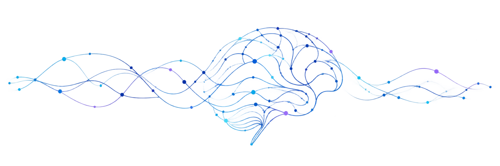

  

<h1 align="center">Asmita</h1>

  <strong>Senior Software Engineer</strong> 
  5+ years building production software for neural, clinical, and medical-imaging systems.  
  <a href="https://www.linkedin.com/in/asmita27/">LinkedIn</a> · <a href="https://doi.org/10.1016/j.neuroimage.2023.120187">Publication</a>

## Focus

- Neural and clinical software, including EEG and signal-processing workflows
- Distributed backends, asynchronous systems, and reliable production releases
- Data and ML infrastructure, from memory-efficient pipelines to transformer fine-tuning

Technical ownership across architecture, engineer guidance, releases, and critical issue resolution.

## Skills

**Engineering:** Python · C# / .NET · SQL · gRPC · Protobuf · concurrent and asynchronous systems

**Data & infrastructure:** MSSQL · DuckDB · Parquet · OLTP / OLAP modelling · Azure · Docker

**Clinical & applications:** HL7 · OAuth · .NET MAUI · MVVM · Skia

**Neural & ML:** EEG · BCI · MNE-Python · MATLAB · neural signal processing · ML/data infrastructure

## Research

MSc in Cognitive Systems, focused on EEG, Brain-Computer Interfaces, neural signal processing, and neurotechnology research.

[*In vivo phase-dependent enhancement and suppression of human brain oscillations by transcranial alternating current stimulation (tACS)*](https://doi.org/10.1016/j.neuroimage.2023.120187) 
NeuroImage, 2023 · [DOI](https://doi.org/10.1016/j.neuroimage.2023.120187)
