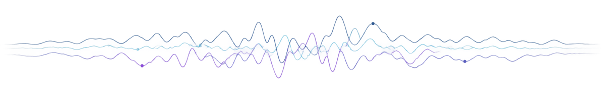

  

# Asmita

**Senior Software Engineer** · Neural, clinical, and medical-imaging systems

5+ years building reliable production software across backend architecture, data systems, and signal-processing workflows.

[LinkedIn](https://www.linkedin.com/in/asmita27/)

## Focus

- Distributed and asynchronous backend systems
- EEG, BCI, clinical software, and neural signal processing
- Memory-efficient data pipelines and ML infrastructure
- Architecture, release ownership, and critical issue resolution

## Skills

**Software:** Python · C# / .NET · .NET MAUI · MVVM · Skia 
**Systems:** gRPC · Protobuf · concurrent and asynchronous workflows 
**Data & platform:** SQL · MSSQL · DuckDB · Parquet · OLTP / OLAP · Azure · Docker 
**Clinical & ML:** HL7 · OAuth · MNE-Python · MATLAB · transformer fine-tuning

## Research

MSc in Cognitive Systems, focused on EEG, Brain-Computer Interfaces, neural signal processing, and neurotechnology.

**Publication:** [*In vivo phase-dependent enhancement and suppression of human brain oscillations by transcranial alternating current stimulation (tACS)*](https://doi.org/10.1016/j.neuroimage.2023.120187) · NeuroImage, 2023 · [DOI](https://doi.org/10.1016/j.neuroimage.2023.120187)
